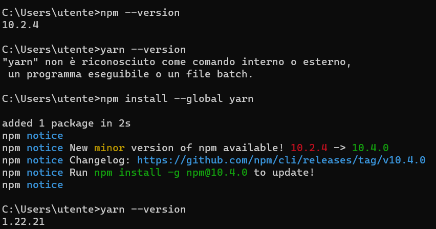

# CHANGE LOG APPUNTI PCTO

## 26/02/2024 - Mattia Ghidoni
- `git`: protocollo a riga di comando usato per gestire le repository.
- `github`: applicativo che sfrutta il protocollo git.
- È stato scaricato l'applicativo github.
- Per il continuo della creazione della repository, clicca [qua](https://github.com/mattghidoni/test-repo/blob/main/CHANGE-LOG.md#caricamento-nuova-repository).

## 27/02/2024 - Mattia Ghidoni
- `Typescript`: versione tipizzata di Javascript ed è più comoda se si vogliono creare applicativi più complessi, dato che Javascript è nato per risolvere problemi più semplici. In quanto Javascript abbia l’interprete che legge il codice, converte e stampa ecc… ci mette molto, invece con Typescript il tutto viene seguito prima, quindi gli eventuali errori vengono visualizzati immediatamente, a differenza di Javascript che non vengono segnalati.
- Per la creazione di un file typescript, è necessario scaricare `Node.js` e `nvm`.
- `nvm` serve per installare più comodamente nuove versioni di Node.js senza ogni volta andare a disinstallare quella precedente e installare quella successiva.
- I due sono stati scaricati da internet e poi con `--version` da prompt si è verificato il loro corretto installamento.
- Con il comando `nvm list` abbiamo visto le versioni installate e abbiamo provato a fare un piccolo comando Javascript. I comandi Javascript del terminale eseguiti con Node.js sono eseguiti dalla stessa engine con cui funzionano browser quali Firefox e Edge.

- Era poi necessario vedere se fosse installato `npm`, una libreria per i comandi di javascript e viene utilizzato con Node.js
- `yarn`: libreria di comandi contenuta in npm ma più vasta di quest’ultimo, dato che per certi versi npm è obsoleta. yarn non era però installato e per farlo è stato necessario utilizzare il comando
    ```sh
    npm install-- global yarn
    ```
    
- Non era erò possibile attivare yarn per creare un file Typescript a causa di una flag attiva di Windows che impediva il suo utilizzo, in quanto non fosse considerata sicura.
- Per disattivare questa flag, è necessario avviare il prompt come amministratore e digitare il seguente comando:
    ```sh
    Set-ExecutionPolicy Unrestricted
    ```
- Ora è possibile usare il comando `yarn init` per creare un nuovo file Typescript.
- Per la creazione del file Typescript, clicca [qua](https://github.com/mattghidoni/prova-typescript/blob/main/CHANGELOG.md#creazione-file-typescript).
- Una volta creato il file Typescript, sono state create delle funzioni come somma e differenza.
- Per i procedimenti per la creazione di funzioni, clicca [qua](https://github.com/mattghidoni/prova-typescript/blob/main/CHANGELOG.md#creazione-delle-funzioni).

## 28/02/2024 - Mattia Ghidoni
- `Funzioni asincrone`: sono funzioni in Typescript che evitano che vengano eseguite istruzioni prima di altre. Per esempio, se ci sono da prelevare dei dati da una macchina per poi stamparli, non posso fare la stampa prima ancora che i dati siano stati prelevati.
- Per la creazione di funzioni asincrone, clicca [qua](https://github.com/mattghidoni/prova-typescript/blob/main/CHANGELOG.md#creazione-di-funzioni-asincrone).
- È stata aggiunta l'estensione di Prettier.
- All'interno della cartella della repository, è stato creato un nuovo file `.pretterrc.json` per dichiarare l'`indentazione` da utilizzare nei codici e ignorare i `;` al termine di ogni istruzione.
- All'interno del nuovo file è quindi stato scritto:
    ```sh
    {
        "tabWidth": 3,
        "semi": false
    }
    ```
- Sono state create delle funzioni asincrone che prendessero dati da un sito web e che stampassero le informazioni rilevate su un nuovo file.
- Per la creazione di funzioni che facessero questo compito, clicca [qua](https://github.com/mattghidoni/prova-typescript/blob/main/CHANGELOG.md#rilevazione-di-dati-da-internet).

## 29/02/2024 - Mattia Ghidoni
- Grazie alla documentazione presente su questo [sito](https://nextjs.org/docs), sono riuscito a iniziare a creare un'app web composta da più pagine e vari elementi.
- Per vedere i passaggi per la creazione della mia app web, clicca [qua](https://github.com/mattghidoni/prova-app-web/blob/master/CHANGE-LOG.md#change-log).

## 01/03/2024 - Mattia Ghidoni
- Ho continuato con la lettura della [documentazione](https://nextjs.org/docs) per la creazione di un'app web.
- Per vedere il continuo dell'attività relativa alla creazione di un'app web, clicca [qua](https://github.com/mattghidoni/prova-app-web/blob/master/CHANGE-LOG.md#aggiunta-pulsanti-e-errore).