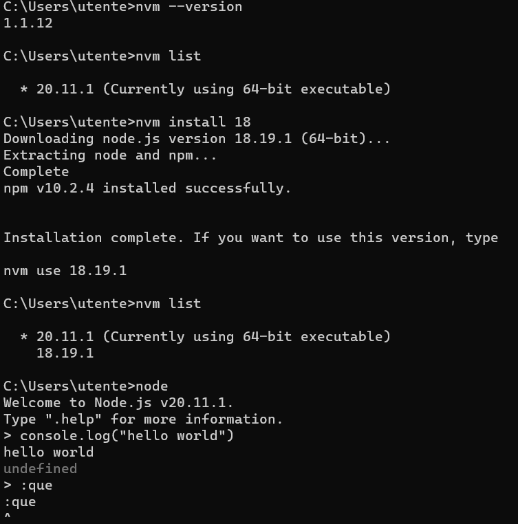

# CHANGE LOG APPUNTI PCTO

26/02/2024 - Mattia Ghidoni

- creato account gitHub: ghidonim20@itisvinci.com e username `mattghidoni`
- `git: protocollo a riga di comando usato per gestire le repository`
- `github: applicativo che sfrutta il protocollo git`
- `git`: protocollo a riga di comando usato per gestire le repository
- `github`: applicativo che sfrutta il protocollo git
- è stato fatto il login su github, in modo tale da poter creare ed utilizzare repository
- è stato scaricato l'applicativo di github
- Per il continuo della creazione della repository, consultare [qua](https://github.com/mattghidoni/test-repo/blob/main/CHANGE-LOG.md)


27/02/2024 - Mattia Ghidoni
- `typescript` è la versione tipizzata di javascript ed è più comoda se si vogliono creare applicativi più complessi, dato che javascript è nato per risolvere problemi più banali. in quanto javascript abbia l’interprete che legge il codice, converte e stampa ecc… ci mette molto, quindi con typescript il tutto viene seguito prima, quindi gli eventuali errori vengono visualizzati immediatamente, a differenza di javascript che non vengono segnalati.
- Per la creazione di un file typescript, è necessario scaricare `Node.js` e `nvm`
- `nvm` serve per installare più comodamente nuove versioni di Node.js senza ogni volta andare a disinstallare quella precedente e installare quella successiva.
- i due sono stati scaricati da internet e poi con `--version` da prompt si è verificato il corretto funzionamento
- con il comando `nvm list` abbiamo visto le versioni installate e abbiamo provato a fare un piccolo comando javascript. i comandi javascript del terminale eseguiti con node.js sono eseguiti dalla stessa engine con cui funzionano browser quali firefox e edge.

- era poi necessario vedere se fosse installato `npm`, una libreria per i comandi di javascript e viene utilizzato con node.js
- `yarn` è una libreria di comandi contenuta in npm ma più vasta di quest’ultimo, dato che per certi versi npm è obsoleta. yarn non era però installato e per installarla è stato necessario utilizzare il comando
    ```sh
    npm install-- global yarn
    ```
    
- Non era erò possibile attivare yarn per creare un file Typescript a causa di una flag attiva di windows che impediva il suo utilizzo, in quanto non fosse considerata sicura.
- per disattivare questa flag, è necessario avviare il prompt come amministratore e digitare il seguente comando:
    ```sh
    Set-ExecutionPolicy Unrestricted
    ```
- Ora è possibile usare il comando `yarn init` per creare un nuovo file Typescript.
- Per la creazione del file Typescript, clicca [qua](https://github.com/mattghidoni/prova-typescript/blob/main/CHANGELOG.md)
- Una volta creato il file typescript, sono state create delle funzioni come somma e differenza
- Per i procedimenti per la creazione di funzioni, clicca [qua](https://github.com/mattghidoni/prova-typescript/blob/main/CHANGELOG.md) e vai nella sezione `CREAZIONE DELLE FUNZIONI`